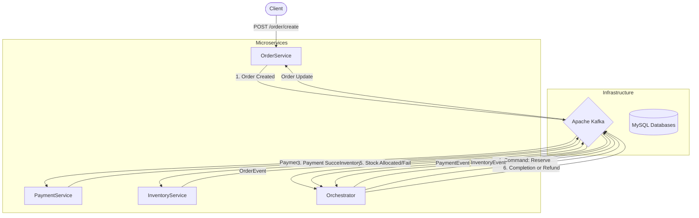

# Distributed Supply Chain System (Saga Orchestration)

This project is an implementation of the Saga Orchestration Pattern using Java and Spring Boot. It demonstrates how to manage distributed transactions across microservices while ensuring data consistency in an eventual consistency model.

The system is designed to handle a supply chain workflow involving Order creation, Payment processing, and Inventory management. It features a custom Stateful Orchestrator that manages transaction lifecycles and triggers compensating transactions (rollbacks) automatically upon failure.

## Architecture Overview

The system utilizes an event-driven architecture where microservices are decoupled and communicate asynchronously via Apache Kafka. A central Orchestrator Service acts as the coordinator, listening to events and issuing commands.

### Transaction Flow
1.  **Order Service:** Receives a request and publishes an `ORDER_CREATED` event.
2.  **Orchestrator:** Persists the transaction state and commands the Payment Service.
3.  **Payment Service:** Processes the debit. If successful, publishes `PAYMENT_COMPLETED`.
4.  **Orchestrator:** Commands the Inventory Service to reserve stock.
5.  **Inventory Service:** Updates stock. If successful, publishes `INVENTORY_ALLOCATED`.
6.  **Orchestrator:** Finalizes the order as `COMPLETED`.

### Failure & Compensation (Rollback)
If the Inventory Service fails (e.g., out of stock) after payment has been deducted:
1.  Inventory publishes `INVENTORY_FAILED`.
2.  Orchestrator identifies the failure and issues a `COMPENSATION` command (Refund) to the Payment Service.
3.  Payment Service processes the refund and confirms.
4.  Orchestrator marks the transaction as rolled back and the Order status is updated to `CANCELLED`.

### System Diagram



## Technology Stack

* **Language:** Java 17
* **Framework:** Spring Boot 3.2.0
* **Messaging:** Apache Kafka, Zookeeper
* **Database:** MySQL 8.0 (Dockerized)
* **Architecture:** Microservices, Event-Driven
* **Build Tool:** Maven

## Project Structure

* **common-dtos:** Shared library containing DTOs, Events, and Enums (`TransactionType`, `OrderStatus`).
* **order-service:** Handles HTTP requests and initiates the Saga.
* **payment-service:** Manages user balances and processes Debit/Credit transactions.
* **inventory-service:** Manages product stock levels.
* **orchestrator-service:** Central coordinator implementing the Saga State Machine.
* **docker-compose.yml:** Infrastructure configuration.

## Setup and Installation

### Prerequisites
* Java 17 or higher installed
* Maven installed
* Docker and Docker Compose installed

### 1. Start Infrastructure
Run the following command in the root directory to start Kafka, Zookeeper, and MySQL.

```bash
docker-compose up -d
Note: The MySQL container maps port 3306 to host port 3307 to avoid conflicts with local MySQL installations.

2. Build the Project
Install the shared library and compile all services.

Bash

mvn clean install
3. Run Microservices
Start the services in the following order. You can run them via IDE or terminal.

Payment Service (Port 8082)

Inventory Service (Port 8083)

Orchestrator Service (Port 8084)

Order Service (Port 8081)

Usage and Testing
1. Happy Path (Successful Transaction)
This scenario simulates a successful order where the user has funds and the product is in stock.

Request:

Bash

curl -X POST http://localhost:8081/order/create \
-H "Content-Type: application/json" \
-d '{
    "userId": 101,
    "productId": 1,
    "amount": 50.0
}'
Expected Result:

Order Service logs: Order finalized with status: ORDER_COMPLETED

2. Insufficient Funds
This scenario simulates a failure at the Payment stage.

Request:

Bash

curl -X POST http://localhost:8081/order/create \
-H "Content-Type: application/json" \
-d '{
    "userId": 101,
    "productId": 1,
    "amount": 20000.0
}'
Expected Result:

Payment Service rejects the transaction.

Order Service logs: Order finalized with status: ORDER_CANCELLED

3. Distributed Compensation (Refund Scenario)
This scenario simulates a failure at the Inventory stage (after Payment succeeds). The system must trigger a refund.

Step A: Simulate Out of Stock Run this command to set inventory to 0:

Bash

docker exec -i mysql-db mysql -uroot -proot inventory_db -e "UPDATE inventory SET available_stock = 0 WHERE product_id = 1;"
Step B: Send Request

Bash

curl -X POST http://localhost:8081/order/create \
-H "Content-Type: application/json" \
-d '{
    "userId": 101,
    "productId": 1,
    "amount": 50.0
}'
Expected Result:

Payment Service deducts amount.

Inventory Service fails allocation.

Orchestrator initiates a refund.

Payment Service processes refund.

Order Service logs: Order finalized with status: ORDER_CANCELLED

Database Configuration
The project utilizes a single MySQL container that initializes distinct logical databases on startup via init.sql:

order_db

payment_db

inventory_db

orchestrator_db

Access the database via localhost:3307 with username root and password root.
